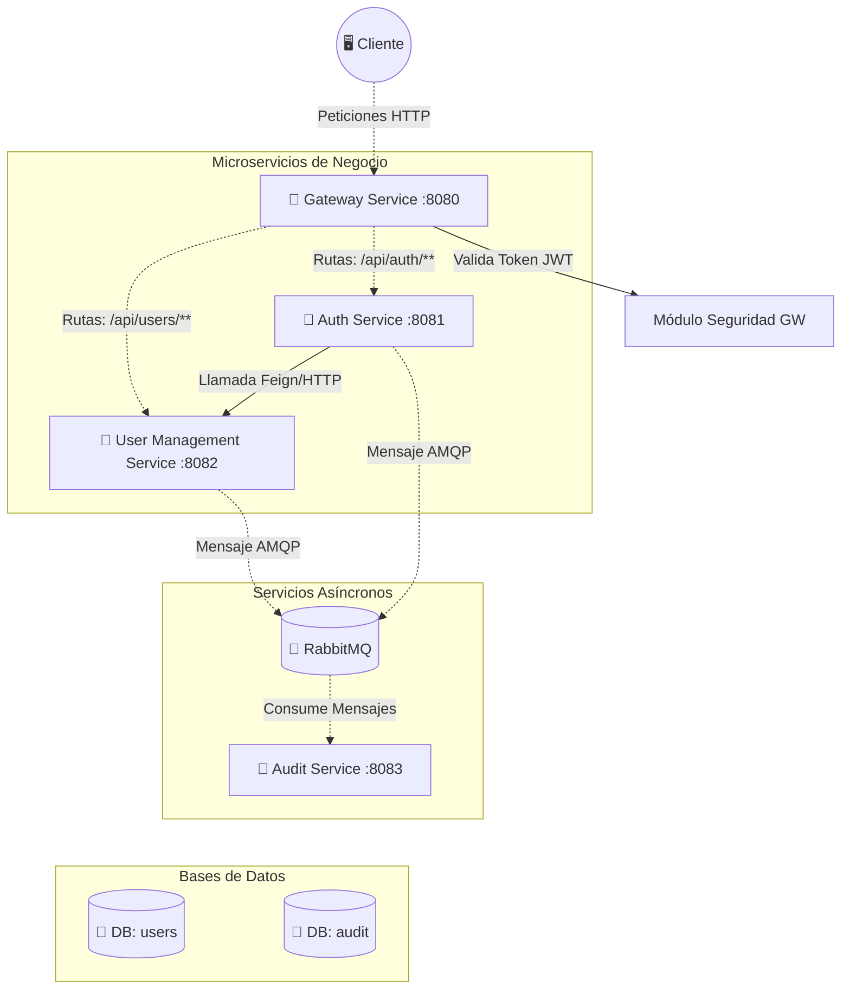

# 🛡️ Auth Microservices Ecosystem

Un robusto sistema de autenticación y autorización basado en arquitectura de microservicios con **Spring Boot 4.0.x**, **Spring Cloud**, **Java 21** y **PostgreSQL**. Cuenta con emisión de JSON Web Tokens (JWT), validación centralizada mediante un API Gateway y un modelo de comunicación asíncrona liderado por **RabbitMQ** para auditorías.

## 🏗️ Arquitectura del Sistema

El ecosistema está fragmentado en componentes independientes pero cohesivos para lograr alta escalabilidad, aplicando conceptos de la **Arquitectura Hexagonal (Puertos y Adaptadores)** y **Clean Architecture** al interior de los dominios más robustos.



### 🧩 Componentes y Funciones

1. **🚪 Gateway Service (`:8080`)**:
   - Funciona como un **Proxy Inverso** único para todo el sistema, enrutando dinámicamente `/api/auth` hacia `auth-service` y `/api/users` hacia `user-management-service`.
   - Incluye un filtro propio que rechaza cualquier petición sin un `Bearer Token` válido, excepto las destinadas a *login*.
   - Extrae los permisos (`claims`) del JWT y los reenvía usando *headers* a los microservicios aguas abajo.

2. **🔐 Auth Service (`:8081`)**:
   - Completamente **Stateless** (Sin DB).
   - Recibe la solicitud de login del Gateway y autentica al usuario comunicándose por HTTP interno con el `user-management-service`.
   - Genera, firma y devuelve el Token JWT (`HS512`).

3. **👤 User Management Service (`:8082`)**:
   - Administra el corazón transaccional del sistema: `Users`, `Roles`, `Permissions` y `Modules`.
   - Diseñado bajo arquitectura hexagonal. Interactúa con una base de datos PostgreSQL (`user-management-service`).
   - Sirve endpoints internos para que el `auth-service` extraiga los perfiles necesarios para construir el Token JWT.

4. **📝 Audit Service (`:8083`)**:
   - Maneja la centralización de logs de la aplicación usando EDA (*Event-Driven Architecture*).
   - No recibe peticiones HTTP directas. Consume "Logs de Auditoría" (ej., Nuevo usuario creado) y "Logs de Errores" provenientes de una cola en RabbitMQ.
   - Persiste estos trazos en su propia base de datos PostgreSQL independiente del resto.

5. **📦 Common-Lib (Librería)**:
   - Depósito genérico transversal. Concentra las utilidades comunes como la clase `JwtUtil`, el filtro `JwtAuthenticationFilter`, el `GlobalExceptionHandler` y los Data Transfer Objects (`DTO`) para envío por RabbitMQ.  
   - Importado por casi todos los otros servicios.  

---

## 🔒 Flujo de Vida de una Petición

#### 1. Login (Autenticación)
El usuario envía sus credenciales al Gateway (`/api/auth/login`). El Gateway identifica la ruta pública y lo deja pasar directo al `Auth Service`. Tras verificar las credenciales con el `User Management Service`, el Auth Service empaqueta los *permisos* en un Token JWT de 512 bits. Se envía JWT firmado de vuelta al cliente.

#### 2. Acceso a Recursos (Autorización)
El cliente trata de consultar usuarios pegándole a `/api/users`. El Gateway **frena** la solicitud, analiza la cabecera `Authorization: Bearer <Token>` y extrae el rol. Si es válido y no expiró, inyecta la cabecera con el *username* y dirige la solicitud final hacia el `user-management-service`.

#### 3. Trazabilidad de Auditoría y Errores (AMQP)
Cualquier éxito clave o cualquier excepción capturada por el `GlobalExceptionHandler` (presente en `common-lib`) inyecta automáticamente un registro serializado usando `StreamBridge` a RabbitMQ. El servicio original despacha el mensaje inmediatamente sin esperar, para no colapsar la respuesta HTTP. El `Audit Service` enciende automáticamente su receptor RabbitMQ y procesa la data.

---

## ⚙️ Tecnologías & Stack

- **Lenguaje:** Java 21 (JDK 21)
- **Framework Core:** Spring Boot 4.0.2
- **Gestión de Dependencias:** Maven (Multi-module)
- **Persistencia de Datos:** Spring Data JPA
- **Base de Datos:** PostgreSQL 17.4
- **Seguridad:** Spring Security & JSON Web Tokens (JJWT)
- **Colas / Mensajería Asíncrona:** RabbitMQ + Spring Cloud Stream 5.0

---

## 🚀 Despliegue & Ejecución

1. **Requisitos Previos**:
   - Tener instalado Java 21 y Apache Maven.
   - Tener funcionando **PostgreSQL** por el puerto 5432.
   - Tener disponible **RabbitMQ** (Recomendado vía docker: `docker run -d --name rabbitmq -p 5672:5672 -p 15672:15672 rabbitmq:3-management` ).

2. **Compilación del Proyecto**  
   Al ser un proyecto multi-módulo, siempre se debe compilar desde la raíz para que el artefacto `common-lib` se disponga en local y los demás servicios lo encuentren:
   ```bash
   ./mvnw clean install -DskipTests
   ```

3. **Orden de Arranque de Microservicios**  
   Se recomienda inicializar los sistemas dependientes de la base de datos primero, luego los controladores:
   1. `user-management-service` y `audit-service`.
   2. `auth-service`
   3. `gateway-service`
